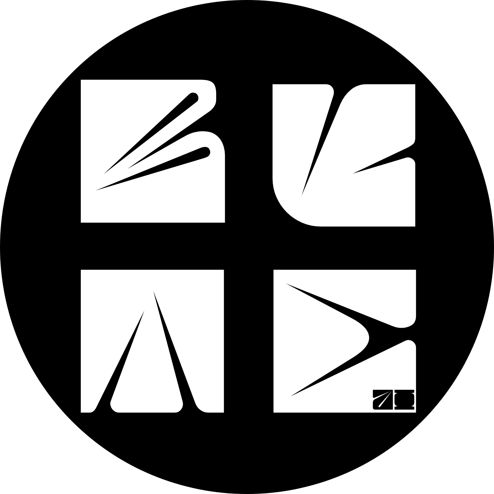
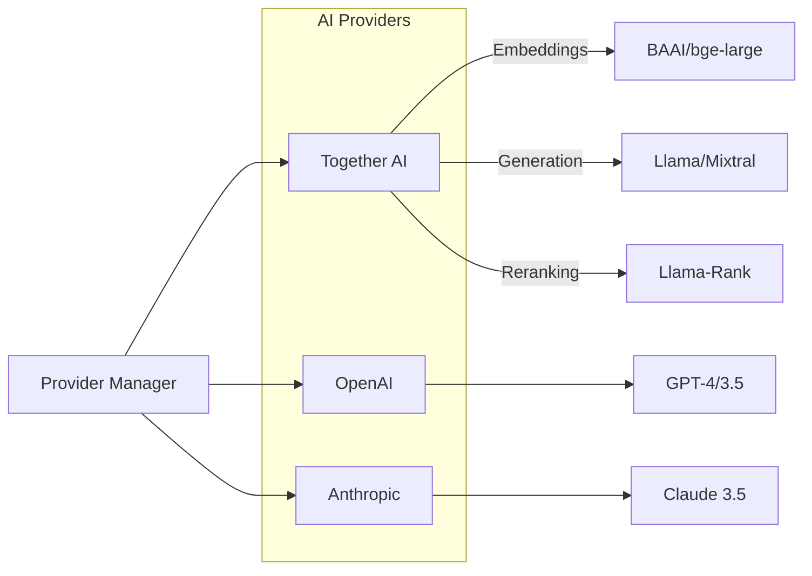
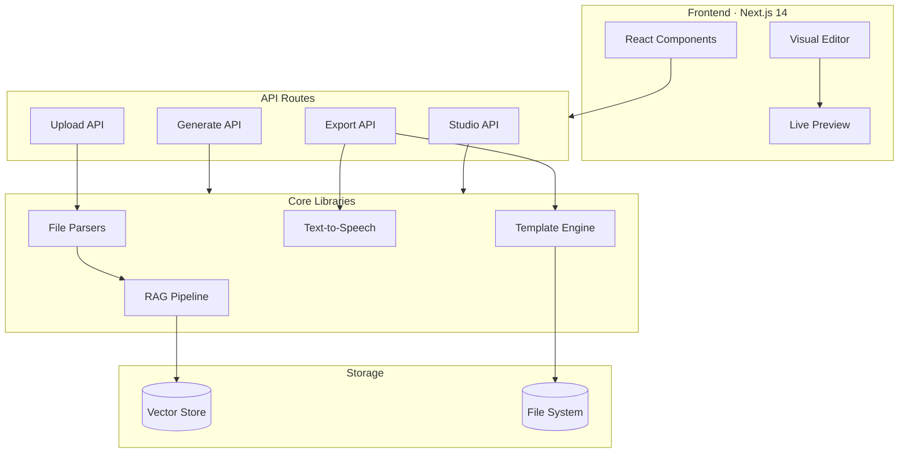
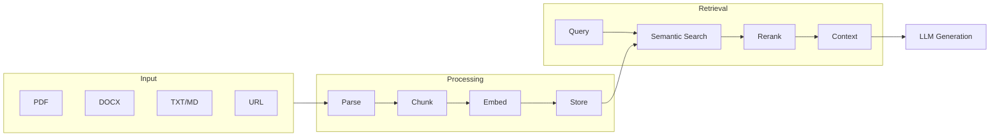
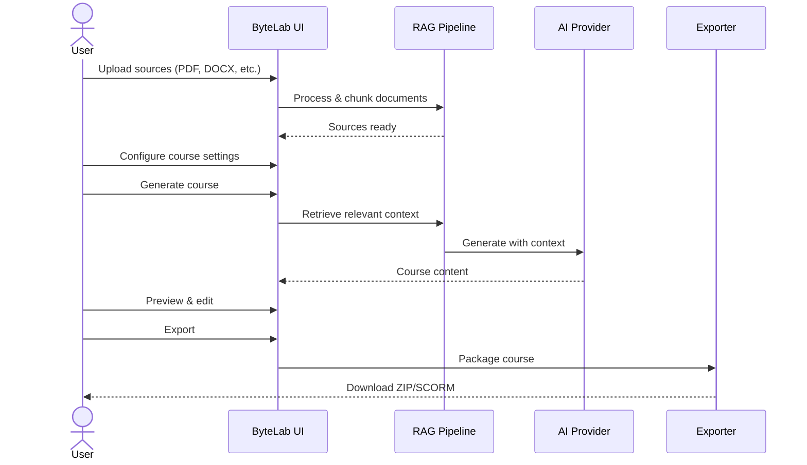

<div align="center">



# ByteLab

### AI-Powered Microlearning Course Builder

*Part of the ByteVerse ecosystem — transforming a single lesson seed into multimodal learning experiences*

[](https://nextjs.org/)
[](https://www.typescriptlang.org/)
[](https://tailwindcss.com/)
[](LICENSE)

[Features](#features) · [Quick Start](#quick-start) · [AI Providers](#ai-providers) · [Templates](#templates) · [Architecture](#architecture) · [Contributing](#contributing)

---

</div>

## Features

<table>
<tr>
<td width="50%">

### Course Generation
- **AI-Powered Content** — Generate complete courses from source materials
- **RAG Pipeline** — Context-aware generation using your uploaded documents
- **Multi-Stage Courses** — Structured learning with progressive stages
- **Interactive Elements** — Quizzes, flashcards, drag-drop exercises

</td>
<td width="50%">

### 14 Visual Templates
- Modern, Minimal, Classic, Magazine
- Card-Based, Timeline, Storybook
- Dashboard, Gaming, Dark Mode
- Corporate, Academic, Creative, Print-Ready

</td>
</tr>
<tr>
<td width="50%">

### Multimodal Output
- **Interactive HTML** — Self-contained courses that work offline
- **Video Version** — Kinetic typography with scene-by-scene narration
- **Podcast Mode** — Dialogue-based audio learning
- **SCORM Export** — LMS-compatible packages

</td>
<td width="50%">

### Editor Blocks
- Text & Headings
- Lists & Code Blocks
- Images & Videos
- Audio Players
- Quizzes & Flashcards
- Drag-Drop Interactions
- Progress Trackers

</td>
</tr>
</table>

---

## Quick Start

### Prerequisites

- Node.js 18+ 
- npm or yarn
- API key from at least one AI provider

### Installation

```bash
# Clone the repository
git clone https://github.com/lorddannykay/ByteLab.git
cd ByteLab

# Install dependencies
npm install

# Set up environment variables
cp .env.example .env.local
```

### Environment Setup

Create a `.env.local` file with your preferred AI provider(s):

```env
# Choose one or more providers:

# Together AI (recommended for cost-effective generation)
TOGETHER_API_KEY=your_together_api_key

# OpenAI (GPT-4, GPT-3.5)
OPENAI_API_KEY=your_openai_api_key

# Anthropic (Claude)
ANTHROPIC_API_KEY=your_anthropic_api_key
```

### Run

```bash
npm run dev
```

Open [http://localhost:3000](http://localhost:3000)

---

## AI Providers

ByteLab supports **multiple AI providers** — use whichever fits your needs:

| Provider | Models | Best For |
|----------|--------|----------|
| **Together AI** | Llama, Mixtral, BAAI embeddings | Cost-effective, open-source models |
| **OpenAI** | GPT-4, GPT-4 Turbo, GPT-3.5 | High-quality generation, wide capabilities |
| **Anthropic** | Claude 3.5 Sonnet, Claude 3 | Long context, nuanced content |

The system **automatically detects** available providers and lets you switch between them in the UI.



---

## Templates

### Course Templates (14 Styles)

Choose from professionally designed templates:

```
┌─────────────┬─────────────┬─────────────┬─────────────┐
│   Modern    │   Minimal   │   Classic   │  Magazine   │
├─────────────┼─────────────┼─────────────┼─────────────┤
│ Card-Based  │  Timeline   │  Storybook  │  Dashboard  │
├─────────────┼─────────────┼─────────────┼─────────────┤
│   Gaming    │  Dark Mode  │  Corporate  │  Academic   │
├─────────────┼─────────────┴─────────────┴─────────────┤
│  Creative   │           Print-Ready                   │
└─────────────┴─────────────────────────────────────────┘
```

### Starter Templates (10 Use Cases)

Pre-configured templates for common training scenarios:

- **Compliance Training** — Policy & regulatory content
- **Product Training** — Feature walkthroughs
- **Onboarding** — New employee orientation
- **Sales Enablement** — Pitch decks & objection handling
- **Technical Tutorial** — Step-by-step guides
- **Safety Training** — Workplace safety modules
- **Process Documentation** — SOPs & workflows
- **Customer Education** — User guides & tutorials
- **Soft Skills** — Communication & leadership
- **Quick Reference** — Cheat sheets & job aids

---

## Architecture



### RAG Pipeline



---

## Project Structure

```
ByteLab/
├── app/                        # Next.js App Router
│   ├── api/                    # API Routes
│   │   ├── generate/           # Content generation endpoints
│   │   ├── studio/             # Studio outputs (audio, video, etc.)
│   │   ├── export/             # Export endpoints (ZIP, SCORM)
│   │   └── upload/             # File upload handlers
│   ├── course/                 # Course pages
│   └── page.tsx                # Dashboard
│
├── components/                 # React Components
│   ├── Editor/                 # Visual editor & blocks
│   ├── Workspace/              # Main workspace panels
│   ├── Dashboard/              # Dashboard components
│   └── Templates/              # Template selectors
│
├── lib/                        # Core Libraries
│   ├── ai/providers/           # AI provider integrations
│   ├── rag/                    # RAG pipeline
│   ├── parsers/                # File parsers
│   ├── templates/              # Course templates
│   ├── generators/             # HTML generators
│   ├── tts/                    # Text-to-speech
│   └── scorm/                  # SCORM packager
│
├── types/                      # TypeScript types
└── assets/                     # Static assets & logos
```

---

## Configuration

### Supported File Types

| Type | Extensions | Parser |
|------|------------|--------|
| PDF | `.pdf` | pdf-parse |
| Word | `.docx` | mammoth |
| Text | `.txt`, `.md` | Native |
| URL | Web pages | Fetch + parse |

### Export Formats

| Format | Description | Use Case |
|--------|-------------|----------|
| **HTML** | Self-contained interactive course | Web hosting, offline use |
| **Video HTML** | Kinetic typography with audio | Video-style learning |
| **Podcast HTML** | Dialogue-based audio player | Audio learning |
| **SCORM 1.2** | LMS-compatible package | Corporate LMS |
| **ZIP** | Complete course bundle | Distribution |

---

## Workflow



---

## Roadmap

- [x] Multi-provider AI support (Together, OpenAI, Anthropic)
- [x] 14 course templates
- [x] RAG-powered content generation
- [x] SCORM export
- [ ] Persistent vector store (Pinecone/Chroma)
- [ ] Real-time collaboration
- [ ] Course analytics dashboard
- [ ] Custom template builder
- [ ] Video rendering with AI avatars
- [ ] Multi-language support

---

## Contributing

We welcome contributions! Here's how to get started:

1. **Fork** the repository
2. **Create** a feature branch
   ```bash
   git checkout -b feature/amazing-feature
   ```
3. **Commit** your changes
   ```bash
   git commit -m 'Add amazing feature'
   ```
4. **Push** to your branch
   ```bash
   git push origin feature/amazing-feature
   ```
5. **Open** a Pull Request

### Development Guidelines

- Follow the existing code style
- Write meaningful commit messages
- Add tests for new features
- Update documentation as needed

---

## License

This project is licensed under the **ISC License** — see the [LICENSE](LICENSE) file for details.

---

<div align="center">

*Part of the ByteVerse ecosystem*

**One seed. Infinite ways to learn.**

[Back to top](#bytelab)

</div>
