<div align="center">

# 🧪 ByteLab

### AI-Powered Microlearning Course Builder

*Part of the ByteVerse ecosystem — transforming a single lesson seed into multimodal learning experiences*

[](https://nextjs.org/)
[](https://www.typescriptlang.org/)
[](https://tailwindcss.com/)
[](LICENSE)

[Features](#-features) • [Quick Start](#-quick-start) • [AI Providers](#-ai-providers) • [Templates](#-templates) • [Architecture](#-architecture) • [Contributing](#-contributing)

---

</div>

## ✨ Features

<table>
<tr>
<td width="50%">

### 📚 Course Generation
- **AI-Powered Content** — Generate complete courses from source materials
- **RAG Pipeline** — Context-aware generation using your uploaded documents
- **Multi-Stage Courses** — Structured learning with progressive stages
- **Interactive Elements** — Quizzes, flashcards, drag-drop exercises

</td>
<td width="50%">

### 🎨 14 Visual Templates
- Modern, Minimal, Classic, Magazine
- Card-Based, Timeline, Storybook
- Dashboard, Gaming, Dark Mode
- Corporate, Academic, Creative, Print-Ready

</td>
</tr>
<tr>
<td width="50%">

### 🎙️ Multimodal Output
- **Interactive HTML** — Self-contained courses that work offline
- **Video Version** — Kinetic typography with scene-by-scene narration
- **Podcast Mode** — Dialogue-based audio learning
- **SCORM Export** — LMS-compatible packages

</td>
<td width="50%">

### 🛠️ Editor Blocks
- Text & Headings
- Lists & Code Blocks
- Images & Videos
- Audio Players
- Quizzes & Flashcards
- Drag-Drop Interactions
- Progress Trackers

</td>
</tr>
</table>

---

## 🚀 Quick Start

### Prerequisites

- Node.js 18+ 
- npm or yarn
- API key from at least one AI provider

### Installation

```bash
# Clone the repository
git clone https://github.com/lorddannykay/ByteLab.git
cd ByteLab

# Install dependencies
npm install

# Set up environment variables
cp .env.example .env.local
```

### Environment Setup

Create a `.env.local` file with your preferred AI provider(s):

```env
# Choose one or more providers:

# Together AI (recommended for cost-effective generation)
TOGETHER_API_KEY=your_together_api_key

# OpenAI (GPT-4, GPT-3.5)
OPENAI_API_KEY=your_openai_api_key

# Anthropic (Claude)
ANTHROPIC_API_KEY=your_anthropic_api_key
```

### Run

```bash
npm run dev
```

Open [http://localhost:3000](http://localhost:3000) 🎉

---

## 🤖 AI Providers

ByteLab supports **multiple AI providers** — use whichever fits your needs:

| Provider | Models | Best For |
|----------|--------|----------|
| **Together AI** | Llama, Mixtral, BAAI embeddings | Cost-effective, open-source models |
| **OpenAI** | GPT-4, GPT-4 Turbo, GPT-3.5 | High-quality generation, wide capabilities |
| **Anthropic** | Claude 3.5 Sonnet, Claude 3 | Long context, nuanced content |

The system **automatically detects** available providers and lets you switch between them in the UI.

```mermaid
flowchart LR
    subgraph Providers["🤖 AI Providers"]
        T[Together AI]
        O[OpenAI]
        A[Anthropic]
    end
    
    PM[Provider Manager] --> T
    PM --> O
    PM --> A
    
    T --> |Embeddings| EMB[BAAI/bge-large]
    T --> |Generation| GEN[Llama/Mixtral]
    T --> |Reranking| RR[Llama-Rank]
    
    O --> GPT[GPT-4/3.5]
    A --> Claude[Claude 3.5]
```



---

## 🎨 Templates

### Course Templates (14 Styles)

Choose from professionally designed templates:

```
┌─────────────┬─────────────┬─────────────┬─────────────┐
│   Modern    │   Minimal   │   Classic   │  Magazine   │
├─────────────┼─────────────┼─────────────┼─────────────┤
│ Card-Based  │  Timeline   │  Storybook  │  Dashboard  │
├─────────────┼─────────────┼─────────────┼─────────────┤
│   Gaming    │  Dark Mode  │  Corporate  │  Academic   │
├─────────────┼─────────────┴─────────────┴─────────────┤
│  Creative   │           Print-Ready                   │
└─────────────┴─────────────────────────────────────────┘
```

### Starter Templates (10 Use Cases)

Pre-configured templates for common training scenarios:

- 📋 **Compliance Training** — Policy & regulatory content
- 🎯 **Product Training** — Feature walkthroughs
- 👋 **Onboarding** — New employee orientation
- 💼 **Sales Enablement** — Pitch decks & objection handling
- 🔧 **Technical Tutorial** — Step-by-step guides
- 🛡️ **Safety Training** — Workplace safety modules
- 📖 **Process Documentation** — SOPs & workflows
- 🎓 **Customer Education** — User guides & tutorials
- 🧠 **Soft Skills** — Communication & leadership
- ⚡ **Quick Reference** — Cheat sheets & job aids

---

## 🏗️ Architecture

```mermaid
flowchart TB
    subgraph Client["🖥️ Frontend (Next.js 14)"]
        UI[React Components]
        Editor[Visual Editor]
        Preview[Live Preview]
    end
    
    subgraph API["⚡ API Routes"]
        Upload["/api/upload"]
        Generate["/api/generate/*"]
        Export["/api/export"]
        Studio["/api/studio/*"]
    end
    
    subgraph Core["🧠 Core Libraries"]
        RAG[RAG Pipeline]
        Parsers[File Parsers]
        Templates[Template Engine]
        TTS[Text-to-Speech]
    end
    
    subgraph Storage["💾 Storage"]
        VS[(Vector Store)]
        FS[(File System)]
    end
    
    UI --> API
    Editor --> Preview
    
    Upload --> Parsers
    Parsers --> RAG
    RAG --> VS
    
    Generate --> Core
    Studio --> Core
    Export --> Templates
    Export --> TTS
    
    Templates --> FS
```



### RAG Pipeline

```mermaid
flowchart LR
    subgraph Input["📄 Input"]
        PDF[PDF]
        DOCX[DOCX]
        TXT[TXT/MD]
        URL[URL]
    end
    
    subgraph Process["⚙️ Processing"]
        Parse[Parse] --> Chunk[Chunk]
        Chunk --> Embed[Embed]
        Embed --> Store[Store]
    end
    
    subgraph Retrieve["🔍 Retrieval"]
        Query[Query] --> Search[Semantic Search]
        Search --> Rerank[Rerank]
        Rerank --> Context[Context]
    end
    
    Input --> Parse
    Store --> Search
    Context --> LLM[LLM Generation]
```



---

## 📁 Project Structure

```
ByteLab/
├── 📂 app/                     # Next.js App Router
│   ├── 📂 api/                 # API Routes
│   │   ├── 📂 generate/        # Content generation endpoints
│   │   ├── 📂 studio/          # Studio outputs (audio, video, etc.)
│   │   ├── 📂 export/          # Export endpoints (ZIP, SCORM)
│   │   └── 📂 upload/          # File upload handlers
│   ├── 📂 course/              # Course pages
│   └── 📄 page.tsx             # Dashboard
│
├── 📂 components/              # React Components
│   ├── 📂 Editor/              # Visual editor & blocks
│   ├── 📂 Workspace/           # Main workspace panels
│   ├── 📂 Dashboard/           # Dashboard components
│   └── 📂 Templates/           # Template selectors
│
├── 📂 lib/                     # Core Libraries
│   ├── 📂 ai/providers/        # AI provider integrations
│   ├── 📂 rag/                 # RAG pipeline
│   ├── 📂 parsers/             # File parsers
│   ├── 📂 templates/           # Course templates
│   ├── 📂 generators/          # HTML generators
│   ├── 📂 tts/                 # Text-to-speech
│   └── 📂 scorm/               # SCORM packager
│
├── 📂 types/                   # TypeScript types
└── 📂 assets/                  # Static assets & logos
```

---

## 🔧 Configuration

### Supported File Types

| Type | Extensions | Parser |
|------|------------|--------|
| PDF | `.pdf` | pdf-parse |
| Word | `.docx` | mammoth |
| Text | `.txt`, `.md` | Native |
| URL | Web pages | Fetch + parse |

### Export Formats

| Format | Description | Use Case |
|--------|-------------|----------|
| **HTML** | Self-contained interactive course | Web hosting, offline use |
| **Video HTML** | Kinetic typography with audio | Video-style learning |
| **Podcast HTML** | Dialogue-based audio player | Audio learning |
| **SCORM 1.2** | LMS-compatible package | Corporate LMS |
| **ZIP** | Complete course bundle | Distribution |

---

## 🎯 Workflow

```mermaid
sequenceDiagram
    actor User
    participant UI as ByteLab UI
    participant RAG as RAG Pipeline
    participant AI as AI Provider
    participant Export as Exporter
    
    User->>UI: Upload sources (PDF, DOCX, etc.)
    UI->>RAG: Process & chunk documents
    RAG-->>UI: Sources ready ✓
    
    User->>UI: Configure course settings
    User->>UI: Generate course
    
    UI->>RAG: Retrieve relevant context
    RAG->>AI: Generate with context
    AI-->>UI: Course content
    
    User->>UI: Preview & edit
    User->>UI: Export
    UI->>Export: Package course
    Export-->>User: Download ZIP/SCORM
```



---

## 🛣️ Roadmap

- [x] Multi-provider AI support (Together, OpenAI, Anthropic)
- [x] 14 course templates
- [x] RAG-powered content generation
- [x] SCORM export
- [ ] Persistent vector store (Pinecone/Chroma)
- [ ] Real-time collaboration
- [ ] Course analytics dashboard
- [ ] Custom template builder
- [ ] Video rendering with AI avatars
- [ ] Multi-language support

---

## 🤝 Contributing

We welcome contributions! Here's how to get started:

1. **Fork** the repository
2. **Create** a feature branch
   ```bash
   git checkout -b feature/amazing-feature
   ```
3. **Commit** your changes
   ```bash
   git commit -m 'Add amazing feature'
   ```
4. **Push** to your branch
   ```bash
   git push origin feature/amazing-feature
   ```
5. **Open** a Pull Request

### Development Guidelines

- Follow the existing code style
- Write meaningful commit messages
- Add tests for new features
- Update documentation as needed

---

## 📄 License

This project is licensed under the **ISC License** — see the [LICENSE](LICENSE) file for details.

---

<div align="center">

### Built with ❤️ as part of the ByteVerse ecosystem

**One seed. Infinite ways to learn.**

[⬆ Back to top](#-bytelab)

</div>