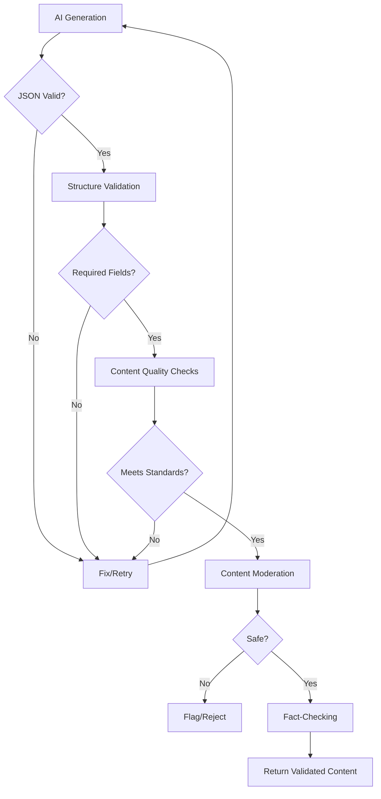

# Quality Guardrails & Sanity Checks

ByteLab includes comprehensive quality assurance mechanisms to ensure generated content meets high standards for completeness, accuracy, and safety.

## Overview

The quality guardrails system provides multiple layers of validation:

1. **JSON Structure Validation** - Ensures AI responses are properly formatted
2. **Content Quality Checks** - Validates content meets minimum requirements
3. **Content Moderation** - Safety checks for inappropriate content
4. **Fact-Checking** - Web search validation for accuracy
5. **Retry & Recovery** - Handles failures gracefully

---

## JSON Structure Validation

### `validateJSONCompleteness()`

Validates that AI-generated JSON responses contain all required fields and are properly structured.

**Features:**
- Required field checking
- Nested structure validation
- Truncation detection
- Empty field warnings

**Usage:**
```typescript
const validation = validateJSONCompleteness(result, 
  ['introduction', 'sections', 'summary'],
  [
    { field: 'sections', required: ['heading', 'content'] }
  ]
);

if (!validation.isValid) {
  throw new Error(`Validation failed: ${validation.errors.join(', ')}`);
}
```

**Checks:**
- All required top-level fields present
- Nested objects/arrays have required sub-fields
- No null or undefined values in required fields
- No empty strings in required fields
- Detects truncated content (ends with `...` or contains `"incomplete"`)

---

## Content Quality Checks

### Introduction Validation

- **Minimum Length:** 100 characters
- **Purpose:** Ensures introductions are meaningful and informative
- **Error Message:** `"Introduction must be at least 100 characters"`

### Section Validation

Each section must meet:
- **Heading:** Minimum 5 characters
- **Content:** Minimum 50 characters
- **Count:** At least 2 sections per stage

**Validation Logic:**
```typescript
if (!section.heading || section.heading.length < 5) {
  errors.push(`Section ${index + 1} heading is too short or missing`);
}
if (!section.content || section.content.length < 50) {
  errors.push(`Section ${index + 1} content is too short (minimum 50 characters)`);
}
```

### Quiz Validation

Comprehensive validation for quiz questions:

**Question Requirements:**
- Minimum 10 characters
- Must be meaningful (not just a letter)

**Option Requirements:**
- Minimum 3 options per question
- Each option must be at least 10 characters
- Options cannot be single letters (A, B, C, D)
- Must include correct answer

**Example Validation:**
```typescript
// Rejects: "A", "B", "C"
// Accepts: "Option A: The correct answer", "Option B: Another choice"

if (option.trim().length === 1 && /^[A-Z]$/.test(option.trim())) {
  errors.push(`Quiz option is just a letter "${option}" - must be meaningful`);
}
```

### Course Completeness Check

`checkCourseCompleteness()` provides a 0-100 completeness score:

**Scoring:**
- Course object: -50 if missing
- Title: -10 if missing
- Description: -10 if missing
- Stages array: -20 if missing
- Each stage title: -2 per missing
- Each stage objective: -2 per missing
- Each stage content: -3 per missing

**Threshold:** 90+ score required for "complete" status

---

## Content Moderation

### Llama Guard Integration

Uses Together AI's Llama Guard model for content safety checks.

**Categories Detected:**
- Violence
- Hate speech
- Harassment
- Self-harm
- Sexual content
- Spam
- Illegal activity

**Usage:**
```typescript
import { moderateContent } from '@/lib/together/moderation';

const result = await moderateContent(text);
if (!result.safe) {
  // Handle unsafe content
}
```

**Safety Features:**
- Defaults to "safe" if moderation fails (fail-safe)
- Returns detailed reason for unsafe content
- Category-specific scoring (0-1 scale)

---

## Retry Logic & Recovery

### Exponential Backoff

`retryWithBackoff()` implements smart retry logic:

**Features:**
- Configurable max retries (default: 3)
- Exponential delay: `initialDelay * 2^attempt`
- Detailed logging of retry attempts
- Preserves last error for debugging

**Example:**
```typescript
const content = await retryWithBackoff(async () => {
  return await aiProvider.generateJSON(prompt);
}, 3, 1000); // 3 retries, starting with 1 second delay
```

**Retry Schedule:**
- Attempt 1: Immediate
- Attempt 2: 1 second delay
- Attempt 3: 2 second delay
- Attempt 4: 4 second delay

### Multi-Model Fallback

For Together AI, the system tries multiple models if one fails:

**Fallback Chain:**
1. `meta-llama/Llama-3.2-3B-Instruct-Turbo` (primary)
2. `openai/gpt-oss-20b` (fallback)
3. `MODELS.CHAT_FREE` (fallback)
4. `MODELS.CHAT` (last resort)

**Benefits:**
- Higher success rate
- Better handling of model-specific issues
- Automatic recovery from temporary failures

---

## Incomplete JSON Repair

### `fixIncompleteJSON()`

Attempts to repair incomplete or malformed JSON responses.

**Features:**
- Removes text before first `{`
- Counts and balances braces
- Intelligently closes incomplete structures
- Handles common truncation patterns

**Example:**
```typescript
const fixed = fixIncompleteJSON('{"course": {"title": "Test"');
// Result: '{"course": {"title": "Test"}}'
```

---

## Integration Points

### Content Generation

**File:** `app/api/generate/content/route.ts`

- Uses `retryWithBackoff()` for generation
- Validates JSON structure with `validateJSONCompleteness()`
- Performs content quality checks
- Validates quiz questions and options

### Outline Generation

**File:** `app/api/generate/outline/route.ts`

- Validates course structure
- Checks stage count matches requested
- Uses `checkCourseCompleteness()` for scoring
- Validates stage structure (id, title, objective)

### Quiz Generation

**File:** `app/api/generate/quiz/route.ts`

- Multi-model fallback for reliability
- Validates quiz structure
- Ensures meaningful questions and options

---

## Validation Flow



---

## Configuration

### Quality Thresholds

Currently hardcoded but can be made configurable:

```typescript
// Content length requirements
const MIN_INTRODUCTION_LENGTH = 100;
const MIN_SECTION_HEADING_LENGTH = 5;
const MIN_SECTION_CONTENT_LENGTH = 50;
const MIN_QUIZ_QUESTION_LENGTH = 10;
const MIN_QUIZ_OPTION_LENGTH = 10;
const MIN_SECTIONS_PER_STAGE = 2;
const MIN_QUIZ_OPTIONS = 3;

// Completeness threshold
const COMPLETENESS_THRESHOLD = 90; // 0-100 score
```

### Retry Configuration

```typescript
// Default retry settings
const DEFAULT_MAX_RETRIES = 3;
const DEFAULT_INITIAL_DELAY = 1000; // milliseconds
```

---

## Error Handling

### Validation Errors

When validation fails, the system:
1. Collects all errors into an array
2. Throws descriptive error message
3. Triggers retry with exponential backoff
4. Logs errors for debugging

**Error Format:**
```
Content quality validation failed: 
Introduction must be at least 100 characters (got 45); 
Section 1 content is too short (minimum 50 characters); 
Quiz 1 option 2 is just a letter "B" - must be meaningful
```

### Moderation Failures

If content moderation fails:
- Defaults to "safe" (fail-safe approach)
- Logs error for monitoring
- Continues with content generation
- Does not block legitimate content

---

## Best Practices

1. **Always Use Retry Logic** - Wrap AI calls in `retryWithBackoff()`
2. **Validate Early** - Check JSON structure before content validation
3. **Check Completeness** - Use `checkCourseCompleteness()` for course data
4. **Monitor Moderation** - Log moderation results for review
5. **Handle Errors Gracefully** - Provide fallbacks for validation failures

---

## Monitoring & Debugging

### Logging

All validation steps log:
- Validation results
- Retry attempts
- Moderation results
- Error details

### Metrics to Track

- Validation success rate
- Average retry count
- Moderation flag rate
- Completeness scores
- Common validation errors

---

## Future Enhancements

- [ ] Configurable quality thresholds via environment variables
- [ ] Custom validation rules per course type
- [ ] Machine learning-based quality scoring
- [ ] Real-time quality dashboard
- [ ] A/B testing for validation rules

